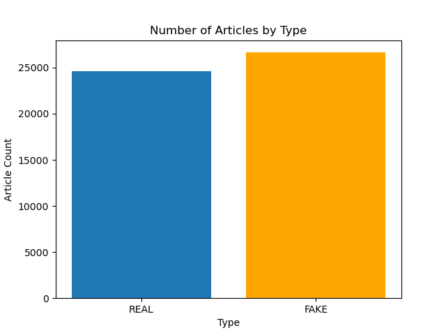

# **IDENTIFYING FAKE NEWS**

## ***Repository for Project 4***

### **Due April 5, 2023**

---
 

<u>**TEAM MEMBERS**</u>

**Bruce Chang**

**Haithem Elmesallati**

**Jonathan Rico**

**Tuan Hoang**

**Ivan Villa**

**Vincent Passanisi**

 

## INTRODUCTION

This is the repository for Project 4 of the UCI DATA ANALYTICS BOOTCAMP. Our presentation webpages can be found here: [Fake News Machine Learning](https://vgpass.github.io/Fake_News_Analysis_Project_4/)

 

## PROJECT PROPOSAL

### ***Identifying Fake News using Natural Language Processing***

*Background*: Fake news has become a significant issue in the modern world, particularly on social media platforms. The proliferation of fake news has the potential to cause real-world harm and confusion, making it important to develop accurate tools to identify it. Natural Language Processing (NLP) is an emerging technology that has shown promise in identifying fake news by analyzing patterns in language use and sentiment.

*Project Description*: This project aims to develop a machine learning model that can identify fake news articles by analyzing a dataset of both real and fake news articles. The dataset will be obtained from reputable sources and will include a variety of topics and themes. Using NLP techniques, we will analyze the language used in the articles, including sentiment analysis, linguistic patterns, and tone. We will then develop a machine learning model that can accurately classify articles as fake or real based on these language features.

*Expected Outcomes*: We expect to create a machine learning model that can accurately identify fake news articles with a high degree of precision. This model will be evaluated using standard metrics, including accuracy, recall, and precision. Additionally, we will conduct a qualitative analysis of the model's performance to identify areas for improvement and future research.

*Conclusion*: The proposed project will contribute to the development of accurate tools for identifying fake news and help to combat the spread of misinformation on social media platforms. The machine learning model developed through this project could be used by news organizations, social media platforms, and individuals to distinguish between real and fake news articles, thus promoting informed decision-making and reducing the spread of misinformation.

## WORK PROCESS

We initially found a dataset on Kaggle with just over six thousand entries. This initial data was used to create notebooks that would clean the data and prepare it for our machine learning models.

Our data set contains 51,233 articles. Of those articles, 24,588 are real and 26,645 are fake.
  

  

Display of unique words in titles and articles
  

  

Our dataset was cleaned using the Natural Language Toolkit (NLTK). First, all unwanted characters, numbers, and symbols were removed. Then all words were converted to lowercase. Stopwords were removed, that is words like 'a', 'the', 'in', 'is', etc. The dataframe then underwent lemmatisation, the process where words are reduced to their simplest inflected form. For example, 'kites' gets changed to 'kite'. 'Babies' would be changed to 'baby'.

Once we were satisfied with the state of our cleaned dataframe, we split the data into training and test sets using a default 75/25 split. Then both sets were transformed using a scikit-learn feature called TfidfVectorizer. This feature creates a matrix of Term Frequency-Inverse Document Frequency. In simple terms, words are given proportional relevance for the number of times they appear in a text, and then this relevance is compensated by the word's frequency in the entire data set.

Several models were then used to train and test the data. The first was a logistic regression model, which showed a model accuracy of 91.55%
  

  

Training and Testing results for the logistic model are displayed below.
  

.png)

