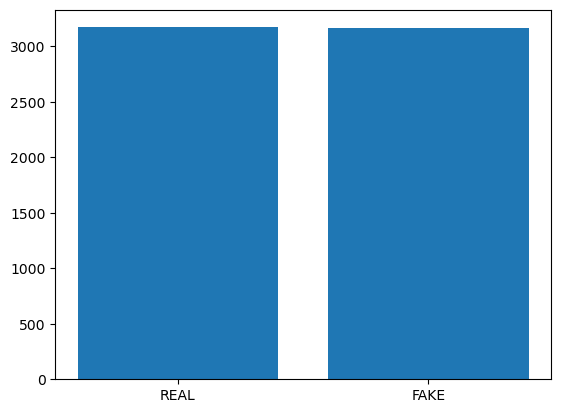

# **Identifying Fake News**

## ***Repo for project 4***

**Bruce Chang**

**Haithem Elmesallati**

**Jonathan Rico**

**Tuan Hoang**

**Ivan Villa**

**Vincent Passanisi**

## PROJECT PROPOSAL

### ***Identifying Fake News using Natural Language Processing***

*Background*: Fake news has become a significant issue in the modern world, particularly on social media platforms. The proliferation of fake news has the potential to cause real-world harm and confusion, making it important to develop accurate tools to identify it. Natural Language Processing (NLP) is an emerging technology that has shown promise in identifying fake news by analyzing patterns in language use and sentiment.

*Project Description*: This project aims to develop a machine learning model that can identify fake news articles by analyzing a dataset of both real and fake news articles. The dataset will be obtained from reputable sources and will include a variety of topics and themes. Using NLP techniques, we will analyze the language used in the articles, including sentiment analysis, linguistic patterns, and tone. We will then develop a machine learning model that can accurately classify articles as fake or real based on these language features.

*Expected Outcomes*: We expect to create a machine learning model that can accurately identify fake news articles with a high degree of precision. This model will be evaluated using standard metrics, including accuracy, recall, and precision. Additionally, we will conduct a qualitative analysis of the model's performance to identify areas for improvement and future research.

*Conclusion*: The proposed project will contribute to the development of accurate tools for identifying fake news and help to combat the spread of misinformation on social media platforms. The machine learning model developed through this project could be used by news organizations, social media platforms, and individuals to distinguish between real and fake news articles, thus promoting informed decision-making and reducing the spread of misinformation.

Our data set contains 6,335 articles. Of those articles, 3171 are real and 3164 are fake.

