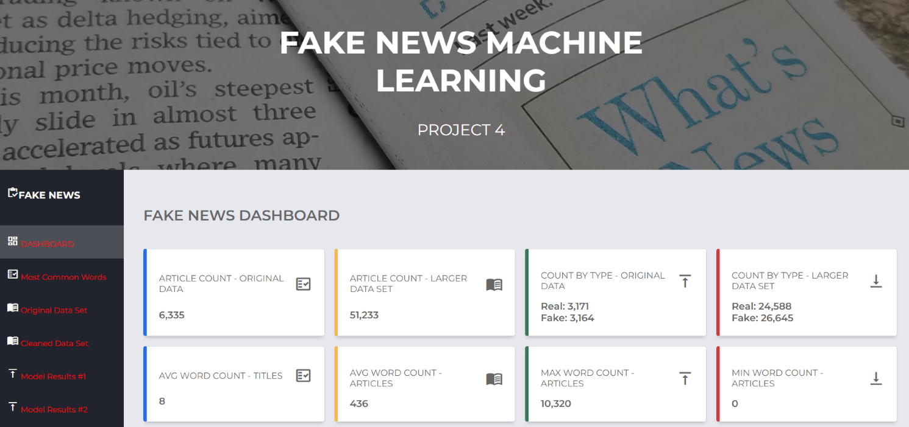
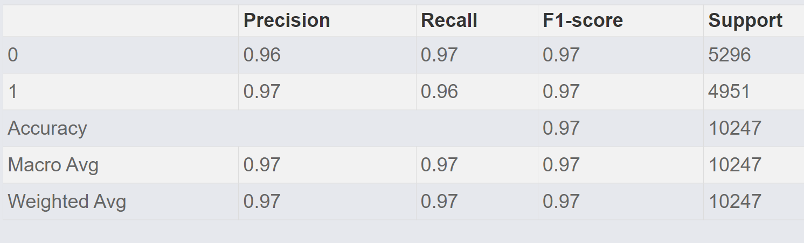
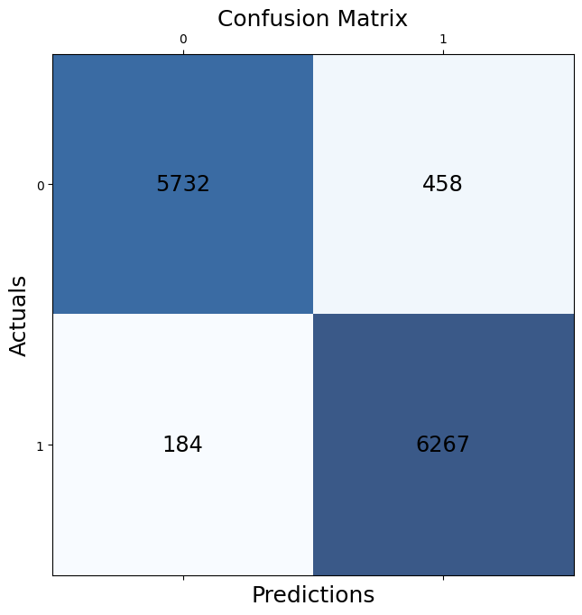

# **IDENTIFYING FAKE NEWS**

## ***Repository for Project 4***

### **Due April 5, 2023**

---
 

<u>**TEAM MEMBERS**</u>

**Bruce Chang**

**Haithem Elmesallati**

**Jonathan Rico**

**Tuan Hoang**

**Ivan Villa**

**Vincent Passanisi**

 

## **INTRODUCTION**

This is the repository for Project 4 of the UCI DATA ANALYTICS BOOTCAMP. Our presentation web pages can be found here: [Fake News Machine Learning](https://vgpass.github.io/Fake_News_Analysis_Project_4/)

 

## **PROJECT PROPOSAL**

### ***Identifying Fake News using Natural Language Processing***

*Background*: Fake news has become a significant issue in the modern world, particularly on social media platforms. The proliferation of fake news has the potential to cause real-world harm and confusion, making it important to develop accurate tools to identify it. Natural Language Processing (NLP) is an emerging technology that has shown promise in identifying fake news by analyzing patterns in language use and sentiment.

*Project Description*: This project aims to develop a machine learning model that can identify fake news articles by analyzing a dataset of both real and fake news articles. The dataset will be obtained from reputable sources and will include a variety of topics and themes. Using NLP techniques, we will analyze the language used in the articles, including sentiment analysis, linguistic patterns, and tone. We will then develop a machine learning model that can accurately classify articles as fake or real based on these language features.

*Expected Outcomes*: We expect to create a machine learning model that can accurately identify fake news articles with a high degree of precision. This model will be evaluated using standard metrics, including accuracy, recall, and precision. Additionally, we will conduct a qualitative analysis of the model's performance to identify areas for improvement and future research.

*Conclusion*: The proposed project will contribute to the development of accurate tools for identifying fake news and help to combat the spread of misinformation on social media platforms. The machine learning model developed through this project could be used by news organizations, social media platforms, and individuals to distinguish between real and fake news articles, thus promoting informed decision-making and reducing the spread of misinformation.

 

## **WORK PROCESS**

We initially found a dataset on Kaggle with just over six thousand entries. This initial data was used to create notebooks that would clean the data and prepare it for our machine learning models. Data Cleaning for Natural Language Processing (NLP) is comprised of modifying the text so that a computer can "understand" it. The process requires the removal of stopwords which are words like 'a', 'an', and 'the'. Unicode text such as punctuation must also be removed, and the text normalized by removing capitalization. Finally the text must undergo two cleaning processes called stemming and lemmatization. In stemming, words are reduced to their simplest inflected form. For example, the words 'walked' and 'walking' become 'walk.' In lemmatization, the same process occurs, but the tense of the word is preserved to assist in interpretation. An example is the word 'walking,' becomes 'walk,' but the word 'walked' produces the output 'walked.'

Python has a library called the Natural Language Toolkit (NLTK), that further prepares a text for machine learning. This toolkit does things like tagging words by parts of speech, fixing misspellings, and sorting the text in ways that will assist the machine learning algorithm. Once we were satisfied with the state of our cleaned dataframe, we split the data into training and test sets using a default 75/25 split. Then both sets were transformed using a scikit-learn feature called *TfidfVectorizer*. This feature creates a matrix of Term Frequency-Inverse Document Frequency. In simple terms, words are given proportional relevance for the number of times they appear in a text, and then this relevance is compensated by the word's frequency in the entire data set. This README is not intended to be a complete introduction to the process and more can be found at sites such as this one [MonkeyLearn Natural Language Processing (NLP): What Is It & How Does it Work?](https://monkeylearn.com/natural-language-processing/).

Once we were satisfied with the state of our data, we began experimenting with various models and settled on three for the machine learning process: Logistic Regression, Linear Support Vector (LSV), and a machine learning algorithm from the Keras library called Bidirectional Encoder Representations from Transformers (BERT).

When we determined our code could successfully be used for text cleaning and running the models, we applied our work to a much larger dataset, also found on Kaggle This data set contained 51,233 articles. Of those articles, 24,588 were real and 26,645 were fake. The much larger data set required much more time and computation power. The BERT model initially took a few hours to run, and needed to be run on Google Collab. The results of our machine learning models can be found here [Model #1](https://vgpass.github.io/Fake_News_Analysis_Project_4/templates/results1.html), here [Model #2](https://vgpass.github.io/Fake_News_Analysis_Project_4/templates/results2.html), and here [Model #3](https://vgpass.github.io/Fake_News_Analysis_Project_4/templates/results3.html).

 

## **PRESENTATION WEB PAGES**

We chose to present our analysis and visualizations using html. Our home page consists of a brief introduction and a dashboard that highlights some of the characteristics of our larger data set. The sidebar has options to visit other pages with additional analysis and visualizations.
   

   

### The side bar navigation has the following options:

* [**Dashboard**](https://vgpass.github.io/Fake_News_Analysis_Project_4/) - Project Introduction and dashboard of basic information.
* [**Common Words**](https://vgpass.github.io/Fake_News_Analysis_Project_4/templates/common.html) - More in-depth analysis of the data characteristics.
* [**Original Text Data**](https://vgpass.github.io/Fake_News_Analysis_Project_4/templates/article.html) - A sample of the original text data *before* cleaning.
* [**Cleaned Text Data**](https://vgpass.github.io/Fake_News_Analysis_Project_4/templates/articles.html) - A sample of the original text data *after* cleaning.
* [**Results Model #1**](https://vgpass.github.io/Fake_News_Analysis_Project_4/templates/results1.html) - Results and analysis of the Logistic Regression model.
* [**Results Model #2**](https://vgpass.github.io/Fake_News_Analysis_Project_4/templates/results2.html) - Results and analysis of the Linear Support Vector model.
* [**Results Model #3**](https://vgpass.github.io/Fake_News_Analysis_Project_4/templates/results3.html) - Results and analysis of the Keras-Bert model.
* [**Resources**](https://vgpass.github.io/Fake_News_Analysis_Project_4/templates/resources.html) - Contains links to our data sets and a list of the python libraries, machine learning tools, and wesite tools used in our project.

  

## Below are a few highlights from our analysis.

 

### Dashboard Image of Article Classification

  

  

### Count of Unique Words in Titles and Articles
  

  

### Classification Report for the LSV Model
  

  

### Training and Testing results for the Logistic Regression model 
  

.png)

  

### Confusion Matrix for the BERT model
  

  

## **FINAL COMMENTS AND THOUGHTS**
 
Our project progressed rapidly, in part due to the highly competent composition of our group. The team was always professional, communicated well, and exhibited an intellectual curiosity that drove us to acheive far better results than we initially thought possible. There was a great deal of experimentation with our models; and admittedly, many failed spectacularly. A little competition spurred each member to try to better the results of his teammates--all in good form. Beer drinking and trips to Disneyland were kept to a minimum, at least until the final days of the project. It must be noted that even those of us with small children did not let interruptions divert us from the task at hand. In our Zoom meetings, crying babies were quickly dealt with, except in those cases where the crying came from team members. It was a lot of fun, and I'm certain we would all choose to work with each other again. Thank you to all!
